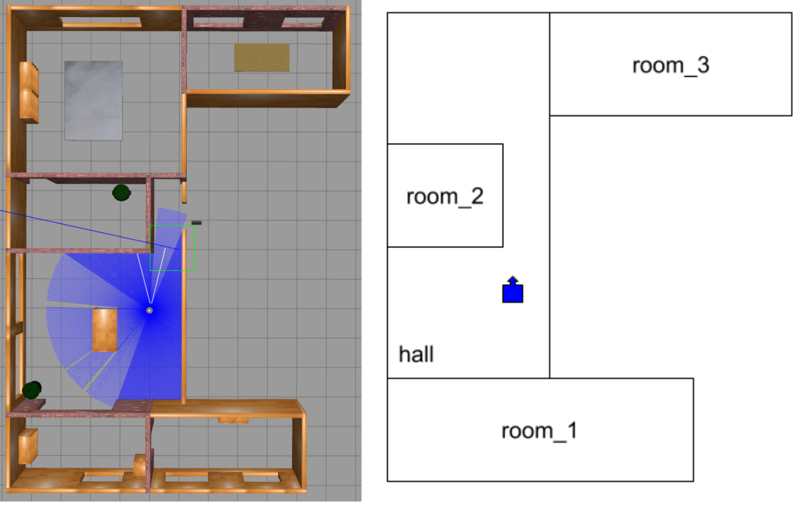

# MultimapRoomNavigator
A ROS 2 Humble package written in C++ for naviagtion of the robot through various areas, switching maps as needed.

## Features
1. Creation of maps and wormholes (map switching point)
2. Auto switching of maps to travel between different locations

## Included ROS2 Packages
- `multimap_wormhole`
- `my_custom_interfaces`

## Dependencies
ROS 2 Humble : [ROS 2 Humble Installation Guide](https://docs.ros.org/en/humble/Installation/Ubuntu-Install-Debs.html)

TurtleBot3 dependencies (You can skip this if your existing simulation setup already integrates Navigation2.)
```bash
sudo apt update
sudo apt install ros-humble-turtlebot3-gazebo ros-humble-navigation2
```

## Installation
1. Clone the repository into your workspace:
```bash
cd ~/<workspace_name>/src
git clone https://github.com/Vidyadharan98/MultimapRoomNavigator.git
```
2. Install dependencies and build:
```bash
cd ~/<workspace_name>
rosdep install --from-paths src --ignore-src -r -y
colcon build 
source install/setup.bash
```

## File Descriptions
- `wormhole_creator.cpp`: Exposes a service “ /create_wormhole “ of a custom service “ TwoString “, which is used to
stamp and save wormhole points between 2 maps while mapping.
- `multi_room_navigator.cpp`: Exposes an action server “ navigate_to_room “ of custom action “ RoomNavigation “. This action server handles receiving goals from the user, navigating to those goals and
switching maps as needed.

## Demo Usage

### Terminal_1:
```bash
ros2 launch turtlebot3_gazebo turtlebot3_house.launch.py
```
### Terminal_2:
```bash
ros2 launch multimap_wormhole multimap_wormhole_demo.launch.xml
```

### Terminal_3:

Here are some known coordinates of corresponding maps along with the command ,
#### hall:
```bash
ros2 action send_goal /navigate_to_room my_custom_interfaces/action/RoomNavigation
"{goal_x: -2.0,goal_y: 4.0, map_name: 'hall'}"
```
#### room_1:
```bash
ros2 action send_goal /navigate_to_room my_custom_interfaces/action/RoomNavigation
"{goal_x: -6.43,goal_y: -2.89, map_name: 'room_1'}"
```
#### room_2:
```bash
ros2 action send_goal /navigate_to_room my_custom_interfaces/action/RoomNavigation
"{goal_x: 1.26,goal_y: 2.53, map_name: 'room_2'}"
```
#### room_3:
```bash
ros2 action send_goal /navigate_to_room my_custom_interfaces/action/RoomNavigation
"{goal_x: 6.15,goal_y: -4.21, map_name: 'room_3'}"
```



Demo video will be uploaded later.

## License

This project is licensed under the [MIT License](LICENSE).